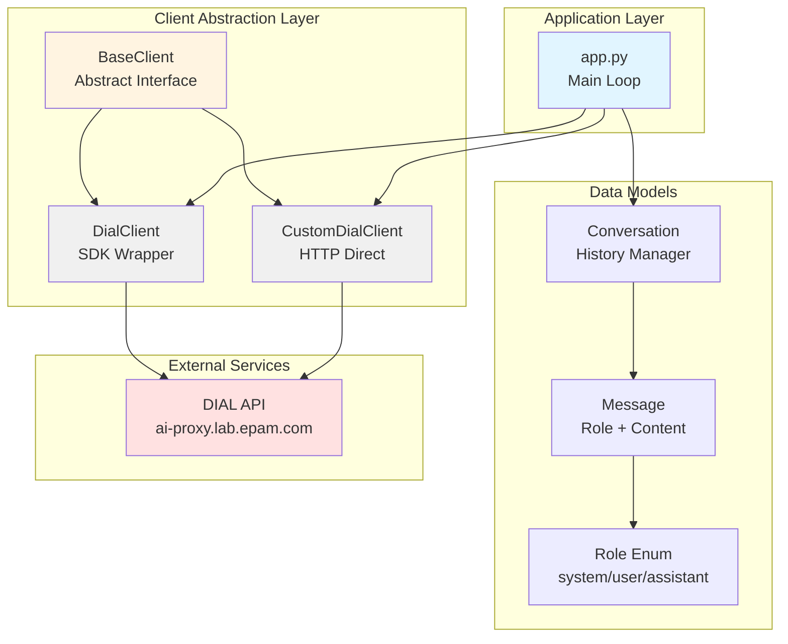
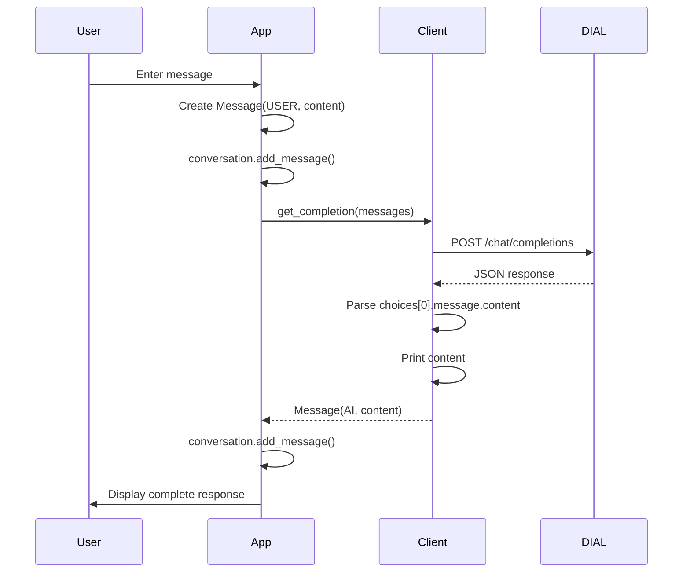
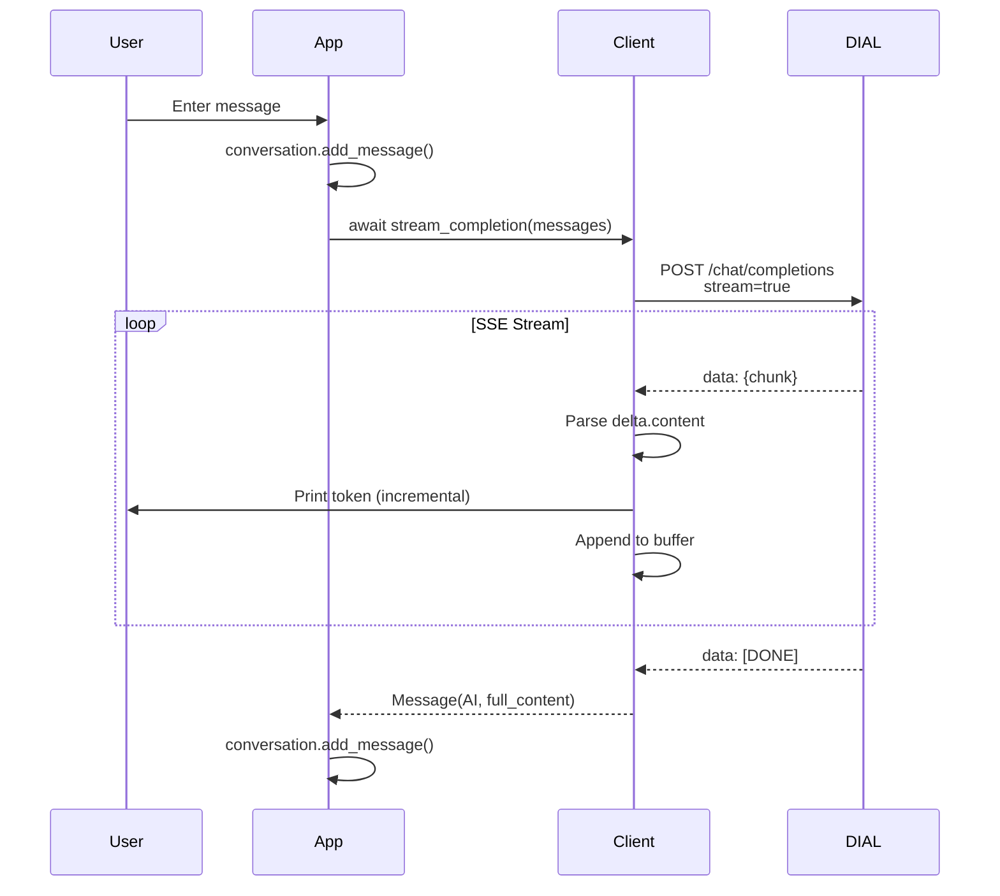
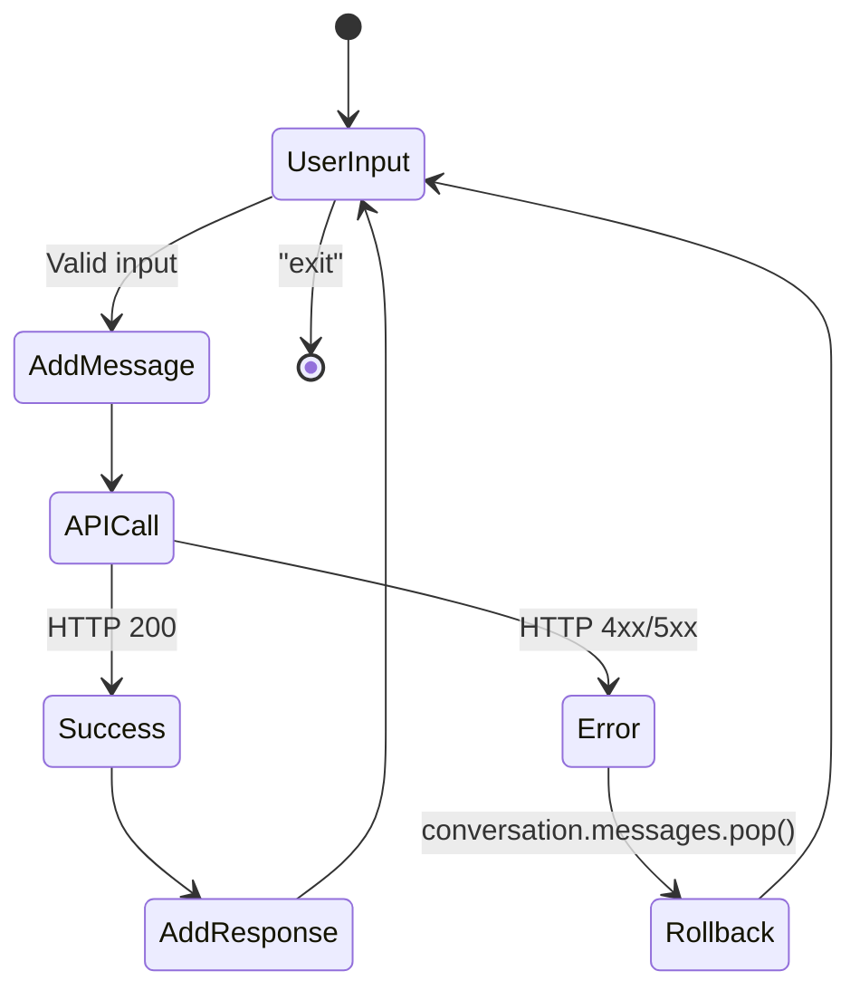
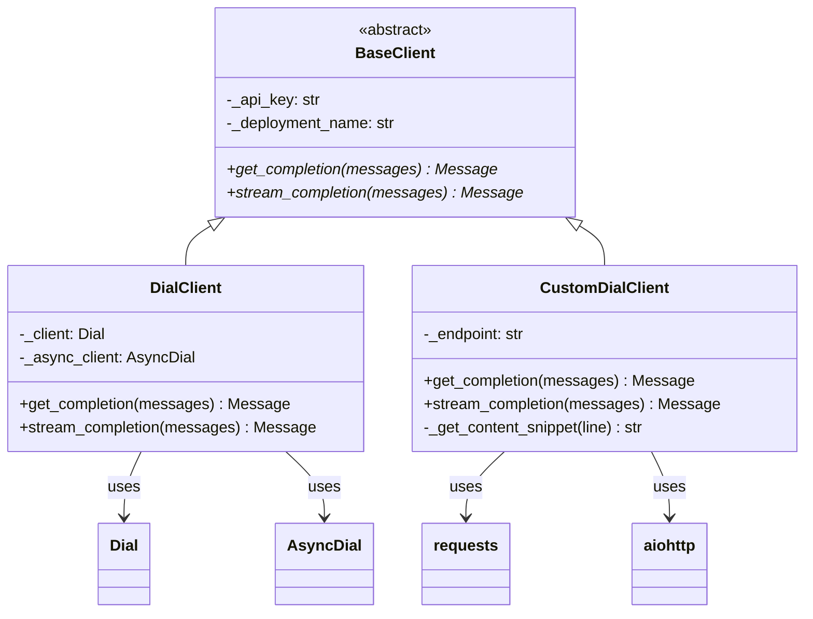

# System Architecture

## Table of Contents

- [Overview](#overview)
- [Architectural Principles](#architectural-principles)
- [System Components](#system-components)
- [Data Flow](#data-flow)
- [Client Architecture](#client-architecture)
- [Message Flow Patterns](#message-flow-patterns)
- [Key Design Decisions](#key-design-decisions)
- [Constraints & Trade-offs](#constraints--trade-offs)

## Overview

DIAL AI Chat Completions uses a layered architecture with clear separation between application logic, client abstraction, and data models. The design emphasizes educational clarity while demonstrating production-ready patterns.



## Architectural Principles

### 1. Educational First
- **Dual implementations** show library abstraction vs. raw HTTP
- **Verbose logging** in CustomDialClient exposes request/response details
- **Simple patterns** prioritize clarity over optimization

### 2. Separation of Concerns
- **Models**: Pure data structures with no business logic
- **Clients**: API communication only, no conversation management
- **App**: Orchestration and user interaction

### 3. Abstraction via Interfaces
- `BaseClient` defines contract for all implementations
- Allows runtime switching between clients without changing application code
- Enables future client additions (e.g., caching, mocking)

### 4. Fail-Safe State Management
- Conversation history rollback on API errors
- Environment-based configuration with validation
- No persistent storage (ephemeral state)

## System Components

### Application Core (`task/app.py`)

**Responsibilities**:
- User input/output handling
- Conversation lifecycle management
- Client orchestration
- Error handling and recovery

**Key Functions**:
```python
async def start(stream: bool) -> None
    # Main event loop: input → API → response → history
```

### Client Layer (`task/clients/`)

#### BaseClient (`base.py`)
Abstract base class enforcing client contract:
```python
class BaseClient(ABC):
    @abstractmethod
    def get_completion(messages: list[Message]) -> Message
    
    @abstractmethod
    async def stream_completion(messages: list[Message]) -> Message
```

**Enforces**:
- API key validation at initialization
- Consistent method signatures
- Type safety with Message objects

#### DialClient (`client.py`)
High-level SDK implementation using `aidial-client`:
- **Sync**: `Dial` class with `.chat.completions.create()`
- **Async**: `AsyncDial` with `stream=True`
- **Minimal code**: ~50 lines total
- **No logging**: Clean output for production use

#### CustomDialClient (`custom_client.py`)
Low-level HTTP implementation:
- **Sync**: `requests.post()` with JSON parsing
- **Async**: `aiohttp.ClientSession` with SSE parsing
- **Verbose logging**: Prints full request/response payloads
- **Manual SSE handling**: Line-by-line parsing of `data:` prefixed events

**SSE Parsing Logic**:
```python
async for line in response.content:
    if line.startswith('data: '):
        data = line[6:]  # Strip prefix
        if data == '[DONE]':
            break
        chunk = json.loads(data)
        content = chunk['choices'][0]['delta']['content']
```

### Data Models (`task/models/`)

#### Message (`message.py`)
```python
@dataclass
class Message:
    role: Role
    content: str
    
    def to_dict() -> dict[str, str]:
        # Converts to API-compatible format
```

#### Role (`role.py`)
```python
class Role(StrEnum):
    SYSTEM = "system"
    USER = "user"
    AI = "assistant"  # Note: maps to "assistant" in API
```

#### Conversation (`conversation.py`)
```python
@dataclass
class Conversation:
    id: str  # UUID
    messages: list[Message]
    
    def add_message(message: Message)
    def get_messages() -> list[Message]
```

## Data Flow

### Synchronous Request Flow



### Streaming Request Flow



### Error Handling Flow



## Client Architecture

### Strategy Pattern Implementation

The dual client design follows the **Strategy Pattern**, allowing runtime selection of API communication strategies:



### Why Two Implementations?

| Aspect | DialClient | CustomDialClient |
|--------|-----------|------------------|
| **Abstraction Level** | High (SDK) | Low (HTTP) |
| **Code Complexity** | ~50 lines | ~140 lines |
| **Debugging** | Limited visibility | Full request/response logs |
| **Dependencies** | aidial-client | requests + aiohttp |
| **Learning Value** | API usage patterns | Protocol internals |
| **Production Use** | Recommended | Debugging/learning |

## Message Flow Patterns

### Request Structure
```json
{
  "messages": [
    {"role": "system", "content": "You are a helpful assistant"},
    {"role": "user", "content": "Hello"},
    {"role": "assistant", "content": "Hi there!"},
    {"role": "user", "content": "How are you?"}
  ]
}
```

### Sync Response Structure
```json
{
  "choices": [
    {
      "message": {
        "role": "assistant",
        "content": "I'm doing well, thank you!"
      }
    }
  ]
}
```

### Streaming Response Structure (SSE)
```
data: {"choices":[{"delta":{"content":"I'm"}}]}

data: {"choices":[{"delta":{"content":" doing"}}]}

data: {"choices":[{"delta":{"content":" well"}}]}

data: [DONE]
```

## Key Design Decisions

### Decision: Dual Client Architecture
**Context**: Educational project needs to show both SDK usage and protocol details

**Decision**: Implement both `DialClient` (SDK) and `CustomDialClient` (raw HTTP) sharing common interface

**Consequences**:
- ✅ Students see abstraction benefits
- ✅ Easy to compare implementations
- ✅ Debugging flexibility
- ⚠️ Duplicate class names require import aliases
- ⚠️ More maintenance overhead

**Status**: Accepted (see [ADR-001](./adr/ADR-001-dual-client-implementation.md))

### Decision: Dataclass-Based Models
**Context**: Need simple, type-safe data structures

**Decision**: Use Python dataclasses for all models

**Consequences**:
- ✅ Zero boilerplate
- ✅ Built-in `__repr__`, `__eq__`
- ✅ Type hints built-in
- ⚠️ No validation logic (intentional for simplicity)

### Decision: Ephemeral State (No Persistence)
**Context**: Educational focus, not production chat application

**Decision**: Keep all conversation state in memory only

**Consequences**:
- ✅ Simple implementation
- ✅ No database dependencies
- ✅ Clear start/stop boundaries
- ⚠️ History lost on exit

### Decision: Manual SSE Parsing
**Context**: Show streaming protocol details in CustomDialClient

**Decision**: Parse SSE format manually instead of using library

**Consequences**:
- ✅ Students understand protocol mechanics
- ✅ No additional dependencies
- ⚠️ More code complexity
- ⚠️ Potential edge cases (handled with try/except)

## Constraints & Trade-offs

### Technical Constraints
1. **Python 3.11+ Required**: Uses `StrEnum` (3.11+ feature)
2. **EPAM VPN Required**: API endpoint only accessible internally
3. **Environment Variables**: API key must be set externally
4. **No Async Main in Sync Methods**: `get_completion()` is synchronous, `stream_completion()` is async

### Educational Trade-offs
1. **No Persistent Storage**: Simplifies implementation, limits practical use
2. **No Automated Tests**: Manual testing only, focuses on implementation learning
3. **No Input Validation**: Trusts user input for brevity
4. **No Retry Logic**: Shows basic error handling only

### Performance Trade-offs
1. **No Request Batching**: One message at a time
2. **No Caching**: Every request hits API
3. **No Connection Pooling**: New connection per request in CustomDialClient
4. **Full Message History**: Sends entire conversation each time (follows DIAL API pattern)

## Open Questions

- **Q**: Should we add connection pooling example in CustomDialClient?
- **Q**: Is rate limiting documentation needed?
- **Q**: Should we show token counting/cost estimation patterns?

---

**Next**: See [API Reference](./api.md) for detailed interface documentation or [ADR Index](./adr/) for decision details.
