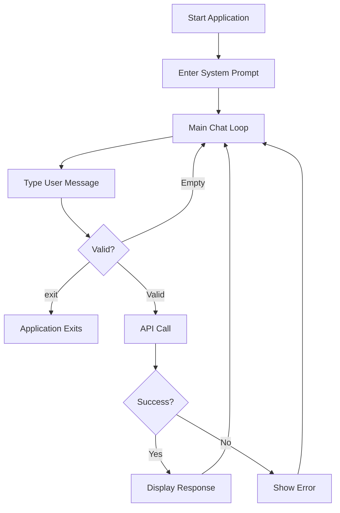

# Testing Guide

## Table of Contents

- [Testing Philosophy](#testing-philosophy)
- [Manual Testing Approach](#manual-testing-approach)
- [Test Scenarios](#test-scenarios)
- [Debugging Strategies](#debugging-strategies)
- [Validation Checklist](#validation-checklist)
- [Common Issues & Solutions](#common-issues--solutions)

## Testing Philosophy

This project uses **manual testing only** - no automated test suite exists. This is intentional for an educational project where:
- Students explore API behavior interactively
- Focus is on implementation, not test coverage
- Visual feedback (streaming output) is primary validation

### Why No Automated Tests?

**Educational Context**:
- Hands-on experimentation teaches more than passing tests
- API key management complicates CI/CD
- Live API calls make tests non-deterministic

**What You Learn Instead**:
- Interactive debugging with real API responses
- Request/response inspection techniques
- Error handling through experimentation

## Manual Testing Approach

### Test Environment Setup

```bash
# Ensure clean environment
source .venv/bin/activate
export DIAL_API_KEY='your-key'
python --version  # Verify 3.11+
```

### Basic Test Workflow



## Test Scenarios

### Scenario 1: Basic Sync Completion

**Objective**: Verify non-streaming mode works correctly

**Steps**:
1. Edit [task/app.py](../task/app.py):
   ```python
   asyncio.run(start(False))  # Non-streaming
   ```
2. Run: `python -m task.app`
3. Enter default system prompt (press Enter)
4. Type: `"What is 2+2?"`
5. Observe complete response appears at once

**Expected**:
```
You: What is 2+2?
Assistant: 2+2 equals 4.
```

**Validation**:
- ✅ Response appears after brief delay
- ✅ Complete answer shown at once (not token-by-token)
- ✅ Conversation continues after response
- ✅ No errors in console

---

### Scenario 2: Streaming Completion

**Objective**: Verify streaming mode displays tokens incrementally

**Steps**:
1. Edit [task/app.py](../task/app.py):
   ```python
   asyncio.run(start(True))  # Streaming
   ```
2. Run: `python -m task.app`
3. Enter custom system prompt: `"Be very verbose"`
4. Ask: `"Explain Python dataclasses in detail"`
5. Observe tokens appear one-by-one

**Expected**:
```
You: Explain Python dataclasses in detail
Assistant: Python[... streaming ...] dataclasses[... streaming ...] are...
```

**Validation**:
- ✅ Tokens appear incrementally (visible typing effect)
- ✅ No buffering delays
- ✅ Complete response assembled correctly
- ✅ Conversation history includes full response

---

### Scenario 3: Multi-Turn Conversation

**Objective**: Verify conversation history maintained across turns

**Steps**:
1. Start application (streaming mode)
2. Turn 1: `"My name is Alice"`
3. Turn 2: `"What's my name?"`
4. Expected: Model remembers "Alice"

**Test Script**:
```
You: My name is Alice
Assistant: Nice to meet you, Alice!

You: What's my name?
Assistant: Your name is Alice.
```

**Validation**:
- ✅ Model recalls previous context
- ✅ Conversation object maintains message history
- ✅ System prompt still effective

---

### Scenario 4: Error Handling - Invalid Model

**Objective**: Test error recovery with wrong deployment name

**Steps**:
1. Edit [task/app.py](../task/app.py):
   ```python
   deployment_name = "invalid-model-name"
   ```
2. Run application
3. Type any message
4. Observe error handling

**Expected**:
```
You: Hello
Error: HTTP 404: Model not found
```

**Validation**:
- ✅ Error caught and displayed
- ✅ User message removed from history
- ✅ Application continues (doesn't crash)
- ✅ Can try again with next message

---

### Scenario 5: Error Handling - Missing API Key

**Objective**: Verify API key validation

**Steps**:
1. Unset API key:
   ```bash
   unset DIAL_API_KEY
   ```
2. Run: `python -m task.app`

**Expected**:
```
Traceback (most recent call last):
  ...
ValueError: API key cannot be null or empty
```

**Validation**:
- ✅ Fails immediately at startup
- ✅ Clear error message
- ✅ No API call attempted

---

### Scenario 6: Empty Input Handling

**Objective**: Test input validation

**Test Sequence**:
```
You: [press Enter without typing]
You: [type spaces only, press Enter]
You: Hello
Assistant: [response]
```

**Validation**:
- ✅ Empty messages ignored (no API call)
- ✅ Whitespace-only messages ignored
- ✅ Valid messages processed normally

---

### Scenario 7: Exit Command

**Objective**: Verify clean shutdown

**Steps**:
1. Start application
2. Type: `exit`

**Expected**:
```
You: exit
Goodbye!
```

**Validation**:
- ✅ Application exits immediately
- ✅ No errors or exceptions
- ✅ Exit code 0

---

### Scenario 8: Custom System Prompt

**Objective**: Test system prompt behavior

**Steps**:
1. Start application
2. Enter custom prompt: `"You are a pirate. Speak like one."`
3. Ask: `"What is Python?"`

**Expected**: Response uses pirate language

**Validation**:
- ✅ Custom prompt overrides default
- ✅ System message added to conversation
- ✅ Behavior persists across turns

---

### Scenario 9: DialClient vs CustomDialClient

**Objective**: Compare two implementations produce same results

**Test A** (DialClient):
```python
client = DialClient(deployment_name)
```

**Test B** (CustomDialClient):
```python
client = CustomDialClient(deployment_name)
```

**Same Input**: `"Count from 1 to 5"`

**Validation**:
- ✅ Both produce equivalent output
- ✅ CustomDialClient shows request/response logs
- ✅ Streaming behavior identical
- ✅ Error handling consistent

---

### Scenario 10: Long Conversation History

**Objective**: Test with many turns

**Steps**:
1. Start application
2. Send 20+ back-and-forth messages
3. Observe memory and performance

**Validation**:
- ✅ No memory leaks
- ✅ Response times consistent
- ✅ History grows correctly
- ✅ No truncation of early messages

---

## Debugging Strategies

### Strategy 1: Use CustomDialClient for Visibility

**When**: API responses unexpected

**How**:
```python
# In task/app.py
client = CustomDialClient(deployment_name)
```

**What You See**:
```
=== REQUEST ===
URL: https://ai-proxy.lab.epam.com/openai/deployments/gpt-4o/chat/completions
Headers: {
  "api-key": "***",
  "Content-Type": "application/json"
}
Body: {
  "messages": [
    {"role": "system", "content": "..."},
    {"role": "user", "content": "..."}
  ]
}
===============

=== RESPONSE ===
Status Code: 200
Response: {
  "choices": [...]
}
================
```

**Benefits**:
- See exact payload sent
- Verify message formatting
- Inspect API response structure
- Diagnose errors

---

### Strategy 2: Add Debug Print Statements

**Example - Track conversation state**:
```python
# In task/app.py, after adding message
conversation.add_message(user_message)
print(f"DEBUG: Conversation has {len(conversation.messages)} messages")
```

**Example - Track streaming chunks**:
```python
# In client.py stream_completion
async for chunk in response:
    print(f"DEBUG: Chunk = {chunk}")  # See raw chunk structure
```

---

### Strategy 3: Python Debugger (pdb)

**Set breakpoint**:
```python
# In task/app.py, before API call
import pdb; pdb.set_trace()
assistant_message = await client.stream_completion(conversation.get_messages())
```

**Debug Commands**:
```
(Pdb) p conversation.messages  # Print message history
(Pdb) p len(conversation.messages)  # Check count
(Pdb) n  # Next line
(Pdb) c  # Continue
```

---

### Strategy 4: Network Traffic Inspection

**macOS/Linux** - Use `tcpdump`:
```bash
# In separate terminal (requires sudo)
sudo tcpdump -i any -A host ai-proxy.lab.epam.com
```

**Any OS** - Use Wireshark:
1. Start capture on active interface
2. Filter: `host ai-proxy.lab.epam.com`
3. Inspect HTTP/HTTPS traffic

---

### Strategy 5: Postman Collection

Use provided [dial-basics.postman_collection.json](../dial-basics.postman_collection.json):

1. Import into Postman
2. Set `{{api-key}}` variable
3. Manually test API endpoints
4. Compare with application behavior

---

## Validation Checklist

### Pre-Deployment Checklist

Before considering implementation complete:

- [ ] **Environment**
  - [ ] Python 3.11+ installed and active
  - [ ] Virtual environment created and activated
  - [ ] All dependencies installed (`pip list` shows correct versions)
  - [ ] `DIAL_API_KEY` environment variable set
  - [ ] VPN connected and API endpoint reachable

- [ ] **Configuration**
  - [ ] Deployment name updated from `"gpt-4"` placeholder
  - [ ] Model name verified against `/openai/models` endpoint
  - [ ] Constants properly imported in all modules

- [ ] **Functional Tests**
  - [ ] Sync mode: Complete response displayed
  - [ ] Streaming mode: Tokens appear incrementally
  - [ ] Multi-turn: Conversation history maintained
  - [ ] Custom system prompt: Behavior changes appropriately
  - [ ] Empty input: Ignored without errors
  - [ ] Exit command: Clean shutdown

- [ ] **Error Handling**
  - [ ] Missing API key: Fails with clear message
  - [ ] Invalid model: Returns error, continues running
  - [ ] Network issues: Caught and reported
  - [ ] Message history: Rolls back on failure

- [ ] **Client Implementations**
  - [ ] DialClient: Works for sync and streaming
  - [ ] CustomDialClient: Works for sync and streaming
  - [ ] Both produce equivalent results
  - [ ] Logging visible in CustomDialClient

- [ ] **Code Quality**
  - [ ] No hardcoded API keys
  - [ ] Type hints present on functions
  - [ ] Comments explain non-obvious logic
  - [ ] No unused imports

---

## Common Issues & Solutions

### Issue: Streaming Not Visible

**Symptom**: Full response appears at once, not token-by-token

**Diagnosis**:
```python
# Check in client implementation
print(content_chunk, end="", flush=True)  # flush=True required!
```

**Solution**: Always use `flush=True` for streaming output

---

### Issue: History Not Maintained

**Symptom**: Model doesn't remember previous messages

**Diagnosis**:
```python
# Add debug in app.py
print(f"Messages sent: {len(conversation.get_messages())}")
```

**Possible Causes**:
- Not calling `conversation.add_message(assistant_message)`
- Creating new Conversation on each turn (check variable scope)

---

### Issue: "No choices in response"

**Symptom**: Exception after API call

**Diagnosis**: Use CustomDialClient to see response

**Common Causes**:
- Invalid model name
- Empty/malformed request
- API service error

**Solution**: Check response structure in logs

---

### Issue: Unicode/Emoji Display Issues

**Symptom**: Weird characters or `UnicodeEncodeError`

**Solution**:
```bash
# Set UTF-8 locale (macOS/Linux)
export LANG=en_US.UTF-8
export LC_ALL=en_US.UTF-8

# Windows: Use Windows Terminal or PowerShell 7+
```

---

### Issue: Slow Responses

**Symptom**: Long wait times for responses

**Possible Causes**:
- Network latency (VPN routing)
- Complex system prompts
- Very long conversation history
- Model throttling

**Debugging**:
1. Check network: `ping ai-proxy.lab.epam.com`
2. Try shorter system prompt
3. Restart conversation (clear history)
4. Try different model (e.g., `gpt-35-turbo` faster than `gpt-4o`)

---

## Testing Best Practices

### Do's ✅

- Test both streaming and non-streaming modes
- Try both client implementations
- Test error scenarios intentionally
- Use CustomDialClient when debugging
- Verify VPN connection before testing
- Keep test sessions short (avoid rate limits)

### Don'ts ❌

- Don't commit API keys
- Don't rely on specific response content (non-deterministic)
- Don't test in production (if one exists)
- Don't skip error scenario testing
- Don't ignore warnings or deprecation messages

---

**Next**: See [API Reference](./api.md) for interface details or [Setup Guide](./setup.md) for configuration help.
